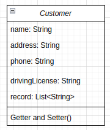
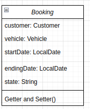
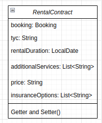
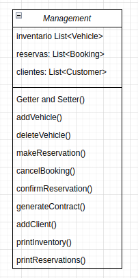

# Diagrama de Clases

Este repositorio contiene un diagrama de clases que representa la estructura de clases y sus relaciones en un sistema específico.

## Estructura del Diagrama

El diagrama de clases representa las principales clases del sistema y sus relaciones. Aquí hay un resumen de las clases clave:

### Clase 1

### Clase 2

### Clase 3

### Clase 4

### Clase 5

